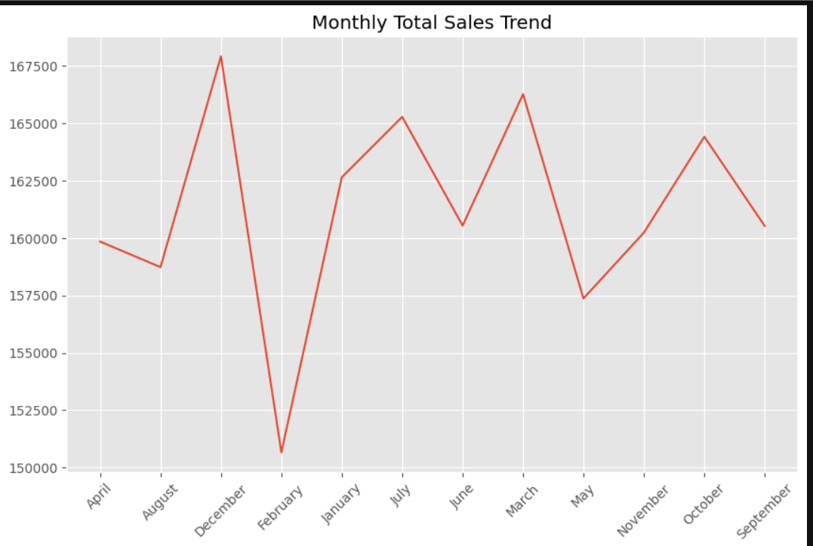
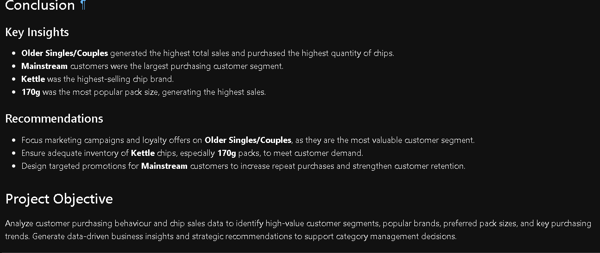
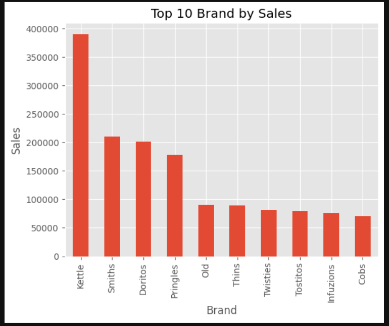
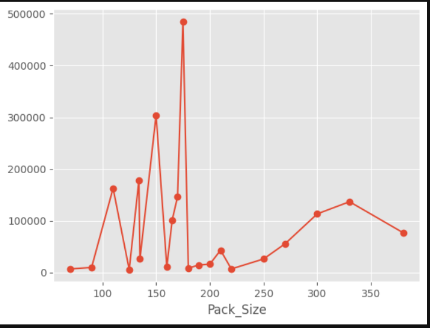

# 🛍️ Retail Customer Purchase Behavior Analysis Using Python

  

### End-to-End Data Analysis Project using Python

> An end-to-end customer purchase behavior analysis project built entirely with Python to clean, analyze, visualize, and uncover actionable insights from retail customer data.

## 📖 Project Overview

This project analyzes retail customer purchasing behavior using Python. The analysis focuses on understanding customer demographics, purchasing patterns, product preferences, spending habits, and business performance through Exploratory Data Analysis (EDA).

The project demonstrates a complete data analysis workflow, from raw dataset exploration to business recommendations using Python libraries.

## 🛠️ Tech Stack

## 🔄 Project Workflow

1. Import Dataset
2. Data Cleaning
3. Data Preprocessing
4. Exploratory Data Analysis (EDA)
5. Customer Behavior Analysis
6. Data Visualization
7. Business Insights
8. Business Recommendations

 ## ⭐ Key Features

- 📊 Performed end-to-end retail customer purchase behavior analysis using Python.
- 🧹 Cleaned and validated transactional retail data.
- ⚙️ Applied feature engineering for deeper customer insights.
- 🔍 Conducted comprehensive Exploratory Data Analysis (EDA).
- 👥 Identified high-value customer segments based on purchasing behavior.
- 🏷️ Analyzed brand performance and customer preferences.
- 📦 Evaluated pack size popularity and purchasing trends.
- 📈 Analyzed monthly, quarterly, and yearly sales performance.
- 📊 Created visualizations using Matplotlib and Seaborn.
- 💡 Generated business insights and strategic recommendations.

- ## 📊 Analysis Performed

The project includes detailed analysis of:

- Customer Demographics
- Age Distribution
- Gender Distribution
- Product Categories
- Purchase Amount Distribution
- Shopping Frequency
- Seasonal Trends
- Customer Segmentation
- Correlation Analysis
- Spending Behavior

-## 🐍 Python Skills Demonstrated

### Libraries Used

- ✅ Pandas
- ✅ NumPy
- ✅ Matplotlib
- ✅ Seaborn

### Data Analysis Skills

- ✅ Data Loading
- ✅ Data Cleaning
- ✅ Data Validation
- ✅ Feature Engineering
- ✅ Exploratory Data Analysis (EDA)
- ✅ Data Aggregation
- ✅ GroupBy Analysis
- ✅ Sorting & Filtering
- ✅ Statistical Analysis
- ✅ Business Insight Generation
- ✅ Data Visualization

## ⭐ Key Features

- 📊 Performed end-to-end retail customer purchase behavior analysis using Python.
- 🧹 Cleaned and preprocessed customer transaction data.
- 🔍 Conducted Exploratory Data Analysis (EDA) to identify purchasing patterns.
- 👥 Analyzed customer segments based on demographics and purchasing behavior.
- 🏷 Evaluated brand performance and customer preferences.
- 📦 Identified the most popular product pack sizes.
- 📈 Analyzed monthly, quarterly, and yearly sales trends.
- 💡 Generated actionable business insights and strategic recommendations.

## 🛠️ Tools & Libraries

- Python
- Pandas
- NumPy
- Matplotlib
- Seaborn
- Jupyter Notebook

 ## 📈 Visualizations

- Top Selling Products
- Top Performing Stores
- Sales by Day of Week
- Top Customers
- Product Quantity Analysis
- Sales Distribution
- Sales Outlier Detection (Box Plot)
- Correlation Heatmap
- Monthly Sales Trend
- Quarterly Sales Trend
- Yearly Sales Trend
- Sales by Customer Life Stage
- Sales by Premium Customer Segment
- Brand Performance
- Pack Size Analysis

## 📊 Project Workflow

1. Data Loading
2. Data Cleaning
3. Data Quality Assessement
4. Feature Engineering
5. Exploratory Data Analysis
6. Customer Segmentation
7. Brand Analysis
8. Pack Size Analysis
9. Business Insights Generation
10. Strategic Recommendations

## 📈 Key Analyses

- Sales Trend Analysis
- Product Performance Analysis
- Store Performance Analysis
- Customer Purchase Behaviour
- Customer Segment Analysis
- Brand Performance Analysis
- Pack Size Analysis
- Monthly, Quarterly, and Yearly Sales Analysis

## 💡 Key Insights

- Older Singles/Couples generated the highest total sales.
- Older Singles/Couples purchased the highest quantity of chips.
- Mainstream customers accounted for the highest purchasing activity.
- Kettle was the highest-selling chip brand.
- 170g was the most popular pack size.
- Sales peaked during December and Q4, indicating strong seasonal demand.

  ## 📈 Results

✔ High-value customer segment identified

✔ Most profitable brand identified

✔ Seasonal demand discovered

✔ Best-selling pack size identified

✔ Customer purchasing behavior analyzed

## 📌 Business Recommendations

- Focus marketing campaigns on Older Singles/Couples.
- Maintain sufficient inventory of Kettle chips, especially 170g packs.
- Design targeted promotions for Mainstream customers.
- Strengthen loyalty programs to improve customer retention.
- Increase inventory and promotional activities before peak sales periods.

## 📁 Repository Structure

|  ─── Data
├──  Cleaned_Retail_Customer_Purchase_Behaviour_Analysis.ipynb
├──  Raw_QVI_transaction_data.csv
├──  Raw_QVI_purchase_behaviour.csv
|  ─── Images
|── Brand_Analysis.png
|── Insights.png
|── Monthly_Sales_trend.png
|── Pack_size_analysis.png 
| ─── README.md

## 🚀 Skills Demonstrated

- Data Cleaning
- Data Wrangling
- Feature Engineering
- Exploratory Data Analysis (EDA)
- Customer Segmentation
- Business Analytics
- Data Visualization
- Business Recommendations
- Python Programming

 📷 Sample Visualizations

Insights & Recommendation

Brand Analysis

Pack Size Analysis

Monthly Trend

## 👨‍💻 Author

**Jatin Patidar**

Aspiring Data Analyst

### Connect with Me

- LinkedIn: https://www.linkedin.com/in/jatinpatidar09/
- GitHub: https://github.com/09jatin
- Email: jatinpatidar606@gmail.com
 
## 📬 Contact

If you found this project useful or have suggestions, feel free to connect with me on LinkedIn or GitHub.

⭐ If you like this project, don't forget to star the repository!

## 🚀 Future Improvements

- Build an interactive dashboard using Power BI.
- Perform predictive analytics using Machine Learning.
- Develop customer churn prediction models.
- Deploy the analysis as an interactive web application.
